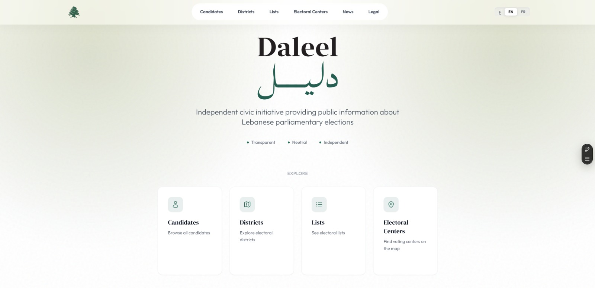

# Daleel - دليل

**Independent, transparent, and security-first platform for Lebanese parliamentary election information.**

Daleel (دليل) is a civic technology initiative dedicated to providing public, educational, and verified information about Lebanese parliamentary elections. Our mission is to empower citizens with accessible data, fostering a more informed and engaged electorate.

---

## ✨ Key Features

- 🌍 **Multilingual Support**: Fully localized in Arabic, English, and French.
- 🔒 **Security-First Design**: Built with an append-only architecture to ensure data integrity and a verifiable historical record.
- 📚 **Rigorous Verification**: Every piece of information is backed by archived sources, ensuring transparency and accountability.
- 📱 **Modern Experience**: A responsive, high-performance web application built with Next.js 14+ and a robust Node.js backend.
- 📊 **Comprehensive Data**: Detailed profiles of candidates, electoral lists, districts, and polling centers.

---

## 🎯 Our Mission

In a complex political landscape, Daleel serves as a neutral and independent guide. We believe that access to verified information is a fundamental right and a cornerstone of democracy. By leveraging modern technology, we aim to bridge the gap between complex electoral data and the voting public.

---

## 🛠️ Technical Overview

Daleel is engineered for reliability and transparency. Our stack includes:

- **Frontend**: Next.js 14 (App Router), Tailwind CSS, Next-Intl.
- **Backend**: Express.js, Prisma ORM, PostgreSQL.
- **Security**: JWT Authentication, CSRF Protection, Rate Limiting, and Immutable Data Models.

> [!TIP]
> **Are you a developer?** Check out our [Technical Documentation](./TECHNICAL.md) for detailed architecture, API references, and setup instructions.

---

## 🚀 Getting Started

To get the project running locally, follow these quick steps:

1. **Clone the repo**
2. **Install dependencies**: `npm run install:all`
3. **Setup Environment**: Configure `.env` files in `backend/` and `frontend/`.
4. **Initialize DB**: `npm run prisma:migrate && npm run seed`
5. **Launch**: `npm run dev`

For a step-by-step guide, see [SETUP.md](./SETUP.md).

---

## 📄 License

This project is open-source. [Specify License Type]

---

**Daleel** - Independent, neutral, transparent election information.
